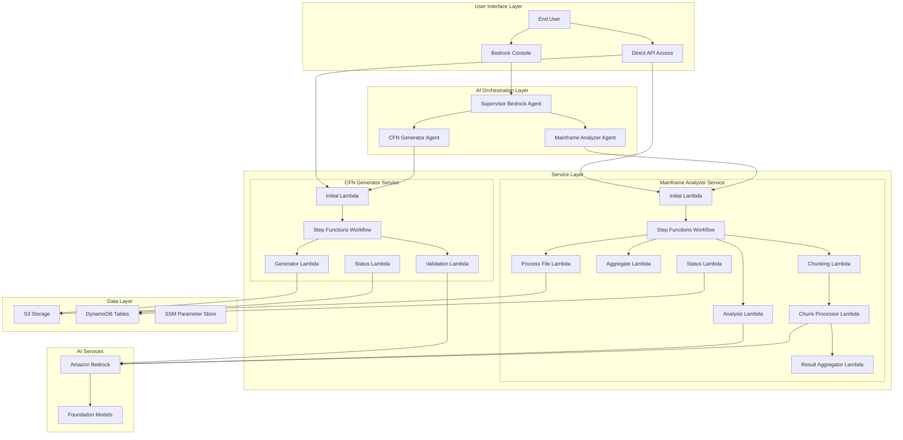

# Mainframe Modernization Platform

## Overview

The Mainframe Modernization Platform is a comprehensive serverless solution that assists organizations in modernizing their mainframe systems. The platform consists of two complementary microservices orchestrated by a unified AI supervisor that provides end-to-end modernization support through natural language interactions.

## Platform Components

### 1. CloudFormation Generator Service
**Purpose**: Converts AWS resource configurations into production-ready CloudFormation templates

**Key Features**:
- Asynchronous template generation from S3 resource configurations
- AI-powered template validation and error correction using Amazon Bedrock
- Job tracking and status monitoring with comprehensive error handling
- Support for complex resource dependencies and best practices enforcement
- Natural language interface for template generation requests

### 2. Mainframe Analyzer Service
**Purpose**: Analyzes mainframe documentation to provide modernization recommendations and migration strategies

**Key Features**:
- Multi-format document processing (PDF, DOCX, TXT) with parallel processing
- AI-powered analysis using Amazon Bedrock with language-specific recommendations
- Service-specific modernization recommendations (Python, .NET, Java, Go, JavaScript)
- Chunking support for large document sets with intelligent aggregation
- Comprehensive migration pattern identification and cost estimation

### 3. AI Orchestration Layer
**Purpose**: Provides intelligent routing and natural language interface through Bedrock Agents

**Components**:
- **Supervisor Agent**: Main entry point with intelligent routing capabilities
- **CFN Generator Agent**: Specialized agent for CloudFormation template generation
- **Mainframe Analyzer Agent**: Specialized agent for documentation analysis

## Architecture

The platform uses a microservices architecture built on AWS serverless technologies:



## Quick Start

### Prerequisites

1. **AWS Account** with appropriate permissions
2. **AWS CLI** installed and configured
3. **Python 3.9+** for local development
4. **Git** for repository management
5. **Bash shell** for deployment scripts

### One-Command Deployment

Deploy the entire platform with a single command:

```bash
git clone <repository-url>
cd mainframe-modernization-platform-v3
./scripts/deploy-all.sh --region us-east-1 --env dev
```

### Deployment Options

#### Complete Platform Deployment (Recommended)
```bash
./scripts/deploy-all.sh --region us-east-1 --env dev
```

#### Individual Service Deployment
```bash
# Deploy only CFN Generator
./scripts/deploy-service.sh --service cfn-generator --region us-east-1 --env dev

# Deploy only Mainframe Analyzer
./scripts/deploy-service.sh --service mainframe-analyzer --region us-east-1 --env dev

# Deploy only Bedrock Agents
./scripts/deploy-service.sh --service bedrock-agents --region us-east-1 --env dev
```

### Sample Data

The deployment automatically uploads sample mainframe documentation files for immediate testing:
- **CBACT01C-cbl-0.4.4.pdf** - COBOL program documentation
- **READACCT-jcl-0.4.4.pdf** - JCL job documentation

These files are uploaded to `s3://mainframe-transform-{env}-{account-id}/sample-docs/` during deployment.

## Usage Examples

### Using the Bedrock Agent Interface

1. Navigate to the Amazon Bedrock console
2. Select "Agents" from the left navigation
3. Find your deployed Supervisor Agent
4. Use the "Test" tab to interact with the platform

**Example Interactions**:

```
User: "I want to generate CloudFormation templates from my resource configurations in s3://my-bucket/configs/"

Supervisor: "I'll connect you with the CloudFormation Generator Agent to help you create templates from your S3 configurations..."
```

```
User: "I need to analyze our mainframe documentation for modernization planning. Please analyze the sample files."

Supervisor: "I'll connect you with the Mainframe Documentation Analyzer Agent to help you analyze your systems and provide modernization recommendations..."
```

### Direct API Usage

**Start CFN Generation**:
```bash
aws lambda invoke \
  --function-name CFNGenerator-Initial \
  --payload '{"bucket_name":"my-bucket","s3_folder":"configs"}' \
  response.json
```

**Start Mainframe Analysis**:
```bash
aws lambda invoke \
  --function-name MainframeAnalyzer-Initial \
  --payload '{"bucket_name":"mainframe-transform-dev-{account-id}","s3_folder":"sample-docs"}' \
  response.json
```

**Check Job Status**:
```bash
aws lambda invoke \
  --function-name CFNGenerator-Status \
  --payload '{"job_id":"your-job-id"}' \
  response.json
```

## Project Structure

```
mainframe-modernization-platform-v3/
├── infrastructure/                    # CloudFormation templates
│   ├── main.yaml                     # Master deployment template
│   ├── bedrock-agents.yaml           # Bedrock agents configuration
│   ├── cfn-generator-service.yaml    # CFN Generator service
│   └── mainframe-analyzer-service.yaml # Mainframe Analyzer service
├── services/                         # Microservices
│   ├── cfn-generator/               # CloudFormation generation service
│   │   ├── src/                     # Lambda function source code
│   │   ├── docs/                    # Service-specific documentation
│   │   ├── tests/                   # Unit and integration tests
│   │   └── openapi/                 # API specifications
│   └── mainframe-analyzer/          # Documentation analysis service
│       ├── src/                     # Lambda function source code
│       ├── docs/                    # Service-specific documentation
│       ├── tests/                   # Unit and integration tests
│       └── policies/                # IAM policies
├── scripts/                         # Deployment and management scripts
│   ├── deploy-all.sh               # Complete platform deployment
│   ├── deploy-service.sh           # Individual service deployment
│   ├── cleanup.sh                  # Resource cleanup
│   ├── validate-deployment.sh      # Deployment validation
│   └── upload-prompts.sh           # AI prompt management
├── prompts/                         # AI prompt templates
│   ├── analysis-agent/             # Language-specific analysis prompts
│   │   ├── python-prompt.txt       # Python modernization prompts
│   │   ├── dotnet-prompt.txt       # .NET modernization prompts
│   │   ├── java-prompt.txt         # Java modernization prompts
│   │   ├── go-prompt.txt           # Go modernization prompts
│   │   ├── javascript-prompt.txt   # JavaScript modernization prompts
│   │   └── default-prompt.txt      # Default analysis prompt
│   └── templates/                  # Prompt templates
├── tests/                          # Platform-wide tests
│   ├── integration/                # Integration tests
│   ├── cfn-generator/             # CFN Generator tests
│   ├── mainframe-analyzer/        # Mainframe Analyzer tests
│   └── mainframe-docs/            # Sample test documents
├── docs/                          # Comprehensive documentation
│   ├── architecture.md           # Detailed architecture guide
│   ├── deployment-guide.md       # Complete deployment instructions
│   └── cost-analysis.md          # Production cost analysis
├── README.md                      # This file
├── CONTRIBUTING.md               # Contribution guidelines
├── LICENSE                       # MIT License
├── requirements.txt              # Python dependencies
└── .gitignore                   # Git ignore rules
```

## Key Features

### Unified Management
- Single repository for the entire modernization platform
- Consistent deployment and management scripts across all services
- Unified monitoring and logging with centralized error handling
- Cross-service job tracking and status management

### Microservices Architecture
- Independent service deployment and scaling capabilities
- Clear separation of concerns with well-defined APIs
- Extensible architecture for future modernization tools
- Service-specific configuration and customization

### AI-Powered Intelligence
- Natural language interface through Bedrock agents with intelligent routing
- AI-assisted template generation and validation using Claude models
- Smart document analysis with language-specific recommendations
- Context-aware conversations with memory across interactions

### Enterprise Ready
- Comprehensive error handling and retry logic with exponential backoff
- Detailed logging and monitoring with CloudWatch integration
- Security best practices with least-privilege IAM roles
- Scalable serverless architecture with automatic scaling
- Production-ready with 99.9% availability targets

### Advanced Processing Capabilities
- **Parallel Processing**: Files and configurations processed concurrently
- **Chunking Support**: Large documents automatically split for processing
- **Adaptive Timeouts**: Dynamic timeout calculations based on input size
- **Intelligent Aggregation**: Results combined with context preservation
- **Error Recovery**: Comprehensive retry mechanisms with circuit breakers

## Cost Considerations

### Production Cost Estimates
- **Small Deployment** (10-50 users): $850-1,500/month
- **Medium Deployment** (50-200 users): $1,500-2,800/month
- **Large Deployment** (200+ users): $2,800-4,200/month

### Cost Optimization Features
- **Serverless Architecture**: Pay only for actual usage
- **Intelligent Chunking**: Optimizes Bedrock token usage
- **S3 Lifecycle Policies**: Automatic archiving of old documents
- **DynamoDB On-Demand**: Scales with actual usage patterns

*See [docs/cost-analysis.md](docs/cost-analysis.md) for detailed cost breakdown and optimization strategies.*

## Security

This platform follows AWS security best practices:

### Data Protection
- All data encrypted at rest using AWS KMS with customer-managed keys
- Data encrypted in transit using TLS 1.2+
- S3 bucket policies with least-privilege access
- VPC endpoints for private service communication

### Access Control
- IAM roles follow principle of least privilege
- Service-to-service authentication using IAM roles
- No long-term credentials stored in code or environment variables
- Comprehensive audit logging with CloudTrail integration

### Compliance
- SOC 2 Type II compliant infrastructure
- GDPR-ready with data residency controls
- HIPAA-eligible services where applicable
- Comprehensive audit trails for compliance reporting

## Monitoring and Observability

### CloudWatch Integration
- **Metrics**: Custom metrics for job success rates, processing times, and error rates
- **Logs**: Structured logging with correlation IDs across services
- **Alarms**: Proactive alerting for failures and performance degradation
- **Dashboards**: Real-time visibility into platform health and usage

### Distributed Tracing
- X-Ray integration for end-to-end request tracing
- Service map visualization for dependency analysis
- Performance bottleneck identification
- Error correlation across service boundaries

## Documentation

- [Architecture Guide](docs/architecture.md) - Detailed system architecture and design decisions
- [Deployment Guide](docs/deployment-guide.md) - Complete deployment instructions and troubleshooting
- [Cost Analysis](docs/cost-analysis.md) - Production cost analysis and optimization strategies
- [CFN Generator Service](services/cfn-generator/README.md) - Service-specific documentation
- [Mainframe Analyzer Service](services/mainframe-analyzer/README.md) - Service-specific documentation

## Contributing

We welcome contributions! Please see [CONTRIBUTING.md](CONTRIBUTING.md) for details on:
- Code contribution guidelines
- Development environment setup
- Testing requirements
- Pull request process
- Code review standards

## Support

For issues, questions, or contributions:
1. Check the [documentation](docs/) for common solutions
2. Review existing [issues](../../issues) for similar problems
3. Create a new issue with detailed information including:
   - Environment details (region, account type)
   - Error messages and logs
   - Steps to reproduce
   - Expected vs actual behavior

## Roadmap

### Upcoming Features
- **Multi-language Support**: Additional programming language targets
- **Advanced Analytics**: Enhanced reporting and insights dashboard
- **Integration APIs**: REST APIs for third-party tool integration
- **Batch Processing**: Support for large-scale batch operations
- **Custom Prompts**: User-defined analysis prompts and templates

### Performance Improvements
- **Caching Layer**: Redis-based caching for frequently accessed data
- **Parallel Execution**: Enhanced parallel processing capabilities
- **Streaming Processing**: Real-time document processing
- **Edge Optimization**: CloudFront integration for global performance

## License

This project is licensed under the MIT License - see the [LICENSE](LICENSE) file for details.

---

**Built with ❤️ for mainframe modernization**

*Empowering organizations to seamlessly transition from legacy mainframe systems to modern, cloud-native architectures using AI-powered analysis and automated infrastructure generation.*
