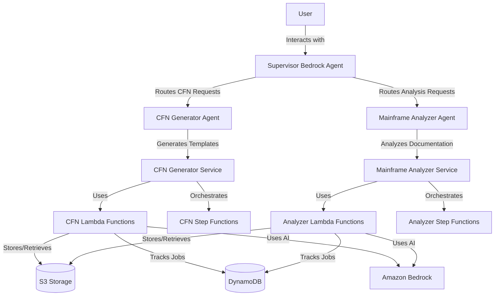

# Mainframe Modernization Platform

## Overview

The Mainframe Modernization Platform is a comprehensive serverless solution that assists organizations in modernizing their mainframe systems. The platform consists of two complementary microservices that work together to provide end-to-end modernization support:

1. **CloudFormation Generator Service** - Converts resource configurations into CloudFormation templates
2. **Mainframe Analyzer Service** - Analyzes mainframe documentation and provides modernization recommendations

Both services are orchestrated by a unified Bedrock Agent supervisor that provides a natural language interface for users.

## Architecture

The platform uses a microservices architecture built on AWS serverless technologies:



## Services

### CloudFormation Generator Service

**Purpose**: Converts AWS resource configurations stored in S3 into well-structured CloudFormation templates.

**Key Features**:
- Asynchronous template generation from S3 resource configurations
- Automatic template validation and error correction using AI
- Job tracking and status monitoring
- Support for complex resource dependencies
- Best practices enforcement

**Use Cases**:
- Converting existing AWS resource configurations to Infrastructure as Code
- Standardizing CloudFormation templates across environments
- Automating template generation for large-scale deployments

### Mainframe Analyzer Service

**Purpose**: Analyzes mainframe documentation to provide modernization recommendations and migration strategies.

**Key Features**:
- Multi-format document processing (PDF, DOCX, TXT)
- Parallel document processing for efficiency
- AI-powered analysis using Amazon Bedrock
- Service-specific modernization recommendations
- Chunking support for large document sets

**Use Cases**:
- Assessing mainframe systems for cloud migration readiness
- Generating modernization roadmaps and strategies
- Identifying migration patterns and dependencies
- Creating cost estimates for modernization projects

## Quick Start

### Prerequisites

1. **AWS Account** with appropriate permissions
2. **AWS CLI** installed and configured
3. **Python 3.9+** for local development
4. **S3 Bucket** for deployment artifacts

### Deployment

1. **Clone the Repository**
```bash
git clone <repository-url>
cd mainframe-modernization-platform
```

2. **Deploy the Entire Platform**
```bash
./scripts/deploy-all.sh --region us-east-1 --env dev
```

3. **Deploy Individual Services** (Optional)
```bash
# Deploy only CFN Generator
./scripts/deploy-service.sh --service cfn-generator --region us-east-1 --env dev

# Deploy only Mainframe Analyzer
./scripts/deploy-service.sh --service mainframe-analyzer --region us-east-1 --env dev
```

### Usage

#### Using the Bedrock Agent Interface

1. Navigate to the Amazon Bedrock console
2. Select "Agents" from the left navigation
3. Find your deployed Supervisor Agent
4. Use the "Test" tab to interact with the platform

**Example Interactions**:

```
User: "I want to generate CloudFormation templates from my resource configurations in s3://my-bucket/configs/"

Supervisor: "I'll connect you with the CloudFormation Generator Agent to help you create templates from your S3 configurations..."
```

```
User: "I need to analyze our mainframe documentation for modernization planning"

Supervisor: "I'll connect you with the Mainframe Documentation Analyzer Agent to help you analyze your systems and provide modernization recommendations..."
```

#### Direct API Usage

**Start CFN Generation**:
```bash
aws lambda invoke \
  --function-name CFNGenerator-Initial \
  --payload '{"bucket_name":"my-bucket","s3_folder":"configs"}' \
  response.json
```

**Start Mainframe Analysis**:
```bash
aws lambda invoke \
  --function-name MainframeAnalyzer-Initial \
  --payload '{"bucket_name":"my-bucket","s3_folder":"docs"}' \
  response.json
```

**Check Job Status**:
```bash
aws lambda invoke \
  --function-name CFNGenerator-Status \
  --payload '{"job_id":"your-job-id"}' \
  response.json
```

## Project Structure

```
mainframe-modernization-platform/
├── services/                    # Microservices
│   ├── cfn-generator/          # CloudFormation generation service
│   └── mainframe-analyzer/     # Documentation analysis service
├── infrastructure/             # Shared infrastructure templates
├── scripts/                   # Deployment and management scripts
├── docs/                     # Comprehensive documentation
└── tests/                   # Testing suites
```

## Key Features

### Unified Management
- Single repository for the entire modernization platform
- Consistent deployment and management scripts
- Unified monitoring and logging

### Microservices Architecture
- Independent service deployment and scaling
- Clear separation of concerns
- Extensible for future modernization tools

### AI-Powered Intelligence
- Natural language interface through Bedrock agents
- Intelligent routing between services
- AI-assisted template generation and validation
- Smart document analysis and recommendations

### Enterprise Ready
- Comprehensive error handling and retry logic
- Detailed logging and monitoring
- Security best practices
- Scalable serverless architecture

## Documentation

- [Architecture Guide](docs/architecture.md) - Detailed system architecture
- [Deployment Guide](docs/deployment-guide.md) - Complete deployment instructions
- [User Guide](docs/user-guide.md) - Usage instructions and examples
- [API Reference](docs/api-reference.md) - API documentation
- [CFN Generator Service](services/cfn-generator/README.md) - Service-specific documentation
- [Mainframe Analyzer Service](services/mainframe-analyzer/README.md) - Service-specific documentation

## Contributing

We welcome contributions! Please see [CONTRIBUTING.md](CONTRIBUTING.md) for details on how to contribute to this project.

## Security

This platform follows AWS security best practices:
- All data encrypted at rest and in transit
- IAM roles follow principle of least privilege
- No sensitive information in environment variables
- Comprehensive audit logging

## Support

For issues, questions, or contributions:
1. Check the [documentation](docs/)
2. Review existing [issues](../../issues)
3. Create a new issue with detailed information

## License

This project is licensed under the MIT License - see the [LICENSE](LICENSE) file for details.

---

**Built with ❤️ for mainframe modernization**
