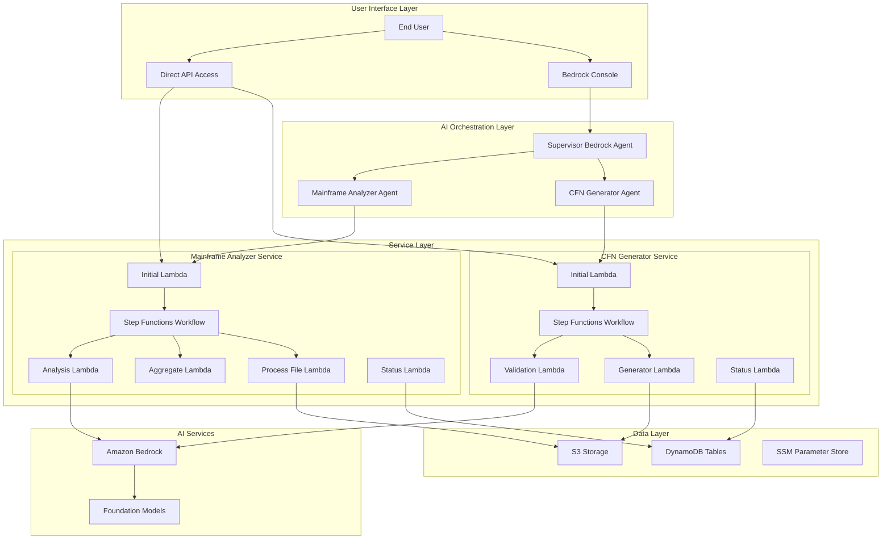

# Mainframe Modernization Platform Architecture

## Overview

The Mainframe Modernization Platform is built using a microservices architecture on AWS serverless technologies. The platform consists of two main services orchestrated by a unified Bedrock Agent supervisor that provides intelligent routing and a natural language interface.

## High-Level Architecture

## Core Components

### 1. AI Orchestration Layer

#### Supervisor Bedrock Agent
- **Purpose**: Main entry point for user interactions
- **Capabilities**: 
  - Natural language understanding
  - Intelligent routing between services
  - Context management across conversations
- **Collaboration Mode**: SUPERVISOR_ROUTER
- **Foundation Model**: Claude 3.5 Haiku

#### Specialized Sub-Agents
- **CFN Generator Agent**: Handles CloudFormation template generation requests
- **Mainframe Analyzer Agent**: Handles documentation analysis requests

### 2. Service Layer

#### CloudFormation Generator Service

**Architecture Pattern**: Event-driven serverless workflow

**Components**:
- **Initial Lambda**: Entry point, validates inputs, creates jobs
- **Generator Lambda**: Processes resource configurations, generates templates
- **Validation Lambda**: Validates templates using AI, fixes errors
- **Completion Lambda**: Finalizes jobs, archives results
- **Status Lambda**: Provides job status and results
- **Step Functions**: Orchestrates the workflow with error handling

**Workflow**:
1. User requests template generation via Bedrock agent or API
2. Initial Lambda validates S3 bucket/folder, creates job in DynamoDB
3. Step Functions workflow starts
4. Generator Lambda processes configurations from S3
5. Validation Lambda validates and fixes templates using Bedrock
6. Completion Lambda archives results and updates job status
7. User can check status and retrieve results

#### Mainframe Analyzer Service

**Architecture Pattern**: Parallel processing with chunking support

**Components**:
- **Initial Lambda**: Entry point, lists files, creates jobs
- **Process File Lambda**: Extracts text from documents (PDF, DOCX, TXT)
- **Aggregate Lambda**: Combines extracted text
- **Chunking Lambda**: Splits large inputs for processing
- **Chunk Processor Lambda**: Processes individual chunks
- **Result Aggregator Lambda**: Combines chunk results
- **Analysis Lambda**: Performs AI analysis using Bedrock
- **Status Lambda**: Provides job status and results
- **Step Functions**: Orchestrates parallel processing workflow

**Workflow**:
1. User requests analysis via Bedrock agent or API
2. Initial Lambda lists files in S3, creates job in DynamoDB
3. Step Functions starts parallel file processing
4. Process File Lambda extracts text from each document
5. Aggregate Lambda combines all extracted text
6. Chunking Lambda evaluates if input needs splitting
7. Analysis Lambda (or Chunk Processor) sends content to Bedrock
8. Results are stored in S3 and job status updated
9. User can check status and retrieve recommendations

### 3. Data Layer

#### Amazon S3
- **Input Storage**: Resource configurations, mainframe documentation
- **Output Storage**: Generated templates, analysis results
- **Intermediate Storage**: Extracted text, processing artifacts
- **Archive Storage**: Completed job artifacts

#### Amazon DynamoDB
- **Job Tracking**: Status, metadata, progress tracking
- **Configuration**: Service settings, parameters
- **Audit Trail**: Job history, execution logs

#### AWS Systems Manager Parameter Store
- **Prompt Templates**: AI prompts for analysis and validation
- **Configuration**: Service configuration parameters
- **Secrets**: Non-sensitive configuration values

### 4. AI Services

#### Amazon Bedrock
- **Foundation Models**: Claude 3.5 Haiku for all agents
- **Inference Profiles**: Cost-optimized model access
- **Use Cases**:
  - Natural language conversation (Supervisor Agent)
  - Template validation and fixing (CFN Generator)
  - Document analysis and recommendations (Mainframe Analyzer)

## Security Architecture

### Identity and Access Management
- **Service Roles**: Each Lambda function has minimal required permissions
- **Cross-Service Access**: Controlled via IAM policies
- **Bedrock Access**: Agents have specific model access permissions

### Data Security
- **Encryption at Rest**: All S3 objects and DynamoDB tables encrypted
- **Encryption in Transit**: All API calls use HTTPS/TLS
- **Access Logging**: CloudTrail logs all API access

### Network Security
- **VPC**: Services can be deployed in VPC for additional isolation
- **Security Groups**: Control network access between components
- **Private Endpoints**: VPC endpoints for AWS service access

## Scalability and Performance

### Horizontal Scaling
- **Lambda Concurrency**: Auto-scaling based on demand
- **Step Functions**: Parallel execution for file processing
- **DynamoDB**: On-demand scaling for job tracking

### Performance Optimization
- **Parallel Processing**: Files processed concurrently
- **Chunking**: Large inputs split for efficient processing
- **Caching**: Parameter Store for configuration caching
- **Timeout Management**: Adaptive timeouts based on input size

### Cost Optimization
- **Inference Profiles**: Cost-optimized Bedrock model access
- **S3 Lifecycle**: Automatic archiving of old job artifacts
- **Lambda Provisioned Concurrency**: Only for high-traffic scenarios

## Monitoring and Observability

### Logging
- **CloudWatch Logs**: All Lambda functions log to dedicated log groups
- **Structured Logging**: JSON format for easy parsing
- **Log Retention**: Configurable retention periods

### Metrics
- **CloudWatch Metrics**: Custom metrics for job success/failure rates
- **Step Functions Metrics**: Workflow execution metrics
- **Bedrock Metrics**: Model invocation and token usage

### Tracing
- **AWS X-Ray**: Distributed tracing across services
- **Correlation IDs**: Track requests across service boundaries

### Alerting
- **CloudWatch Alarms**: Alert on error rates, timeouts
- **SNS Notifications**: Alert delivery to operations teams

## Disaster Recovery

### Backup Strategy
- **S3 Cross-Region Replication**: Critical data replicated
- **DynamoDB Point-in-Time Recovery**: Continuous backups
- **CloudFormation Templates**: Infrastructure as Code for recovery

### Recovery Procedures
- **Multi-Region Deployment**: Services can be deployed across regions
- **Automated Recovery**: CloudFormation for infrastructure recreation
- **Data Recovery**: S3 and DynamoDB backup restoration procedures

## Extension Points

### Adding New Services
1. Create service directory under `services/`
2. Implement Lambda functions following established patterns
3. Create CloudFormation template for service infrastructure
4. Add service-specific Bedrock agent (optional)
5. Update Supervisor Agent with new routing logic

### Integration Patterns
- **Event-Driven**: Services communicate via S3 events, DynamoDB streams
- **API-Driven**: Direct Lambda invocation for synchronous operations
- **Workflow-Driven**: Step Functions for complex orchestration

This architecture provides a solid foundation for mainframe modernization while maintaining flexibility for future enhancements and integrations.
