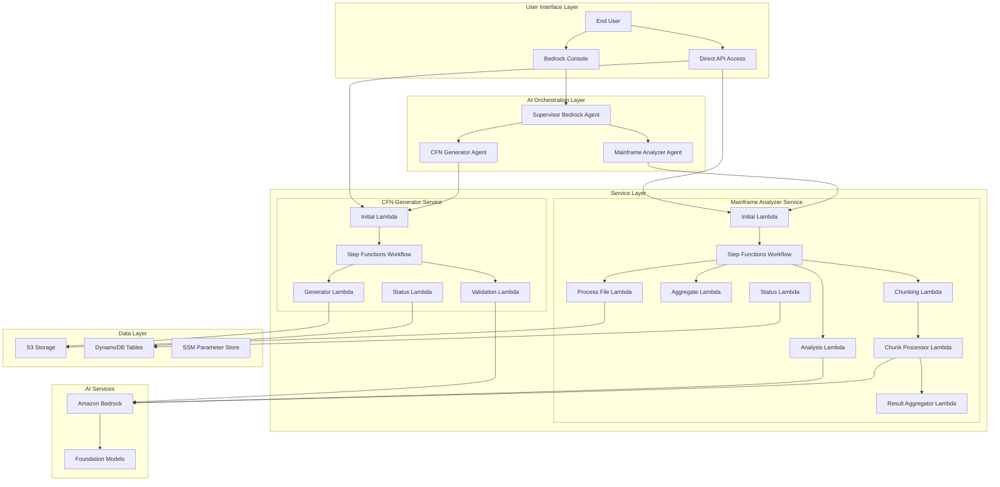
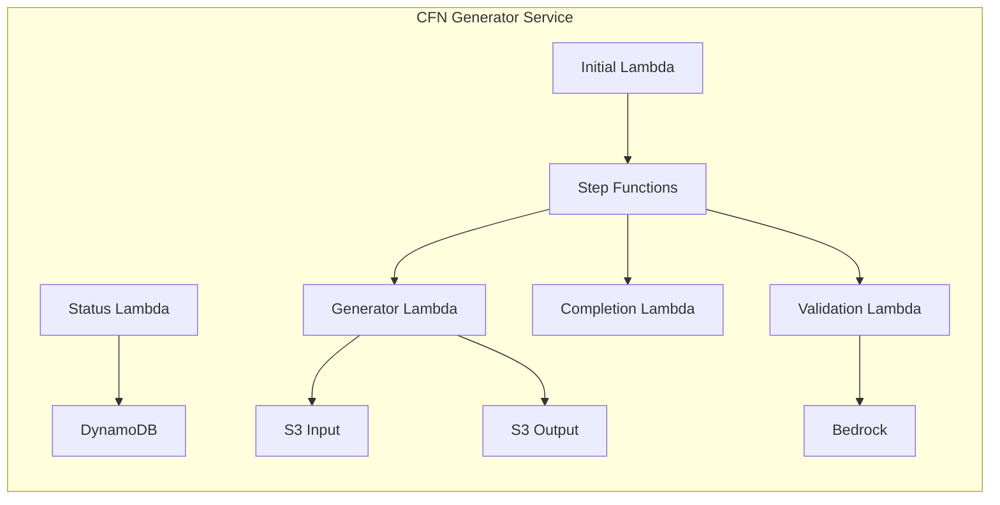
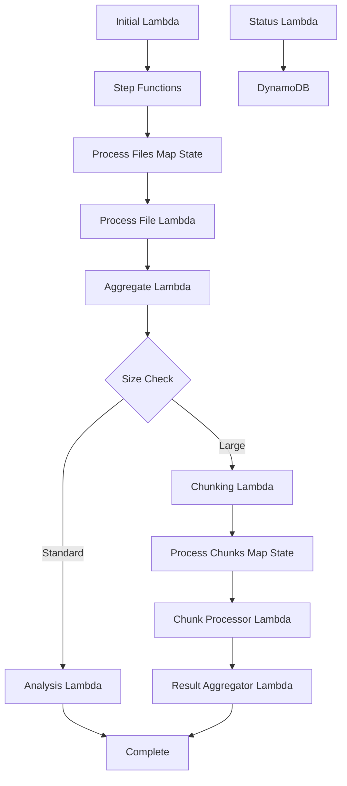

# Mainframe Modernization Platform Architecture

## Overview

The Mainframe Modernization Platform is built using a microservices architecture on AWS serverless technologies. The platform consists of two main services orchestrated by a unified Bedrock Agent supervisor that provides intelligent routing and a natural language interface.

## High-Level Architecture



## Core Components

### 1. AI Orchestration Layer

#### Supervisor Bedrock Agent
- **Purpose**: Main entry point for user interactions
- **Capabilities**: 
  - Natural language understanding
  - Intelligent routing between services
  - Context management across conversations
- **Collaboration Mode**: SUPERVISOR_ROUTER
- **Foundation Model**: Claude 3.5 Haiku

#### Specialized Sub-Agents
- **CFN Generator Agent**: Handles CloudFormation template generation requests
- **Mainframe Analyzer Agent**: Handles documentation analysis requests

### 2. CloudFormation Generator Service

#### Architecture Components



#### Lambda Functions

1. **Initial Lambda**
   - **Runtime**: Python 3.9
   - **Memory**: 1GB
   - **Timeout**: 5 minutes
   - **Purpose**: Entry point, validates input, creates job record
   - **Triggers**: Direct invocation, Bedrock Agent

2. **Generator Lambda**
   - **Runtime**: Python 3.9
   - **Memory**: 2GB
   - **Timeout**: 15 minutes
   - **Purpose**: Processes configurations, generates templates
   - **Integrations**: S3, Parameter Store

3. **Validation Lambda**
   - **Runtime**: Python 3.9
   - **Memory**: 1GB
   - **Timeout**: 10 minutes
   - **Purpose**: Validates templates using Bedrock
   - **AI Model**: Claude 3 Sonnet

4. **Status Lambda**
   - **Runtime**: Python 3.9
   - **Memory**: 512MB
   - **Timeout**: 30 seconds
   - **Purpose**: Provides job status and results

#### Step Functions Workflow

```json
{
  "Comment": "CFN Generator Workflow",
  "StartAt": "GenerateTemplate",
  "States": {
    "GenerateTemplate": {
      "Type": "Task",
      "Resource": "arn:aws:lambda:region:account:function:CFNGenerator-Generator",
      "Next": "ValidateTemplate",
      "Retry": [
        {
          "ErrorEquals": ["States.TaskFailed"],
          "IntervalSeconds": 2,
          "MaxAttempts": 3,
          "BackoffRate": 2.0
        }
      ]
    },
    "ValidateTemplate": {
      "Type": "Task",
      "Resource": "arn:aws:lambda:region:account:function:CFNGenerator-Validation",
      "Next": "CompleteJob",
      "Retry": [
        {
          "ErrorEquals": ["States.TaskFailed"],
          "IntervalSeconds": 2,
          "MaxAttempts": 3,
          "BackoffRate": 2.0
        }
      ]
    },
    "CompleteJob": {
      "Type": "Task",
      "Resource": "arn:aws:lambda:region:account:function:CFNGenerator-Completion",
      "End": true
    }
  }
}
```

### 3. Mainframe Analyzer Service

#### Architecture Components



#### Lambda Functions

1. **Initial Lambda**
   - **Runtime**: Python 3.9
   - **Memory**: 1GB
   - **Timeout**: 5 minutes
   - **Purpose**: Lists files, creates job, starts workflow

2. **Process File Lambda**
   - **Runtime**: Python 3.9
   - **Memory**: 3GB
   - **Timeout**: 15 minutes
   - **Purpose**: Extracts text from PDF, DOCX, TXT files
   - **Libraries**: PyPDF2, python-docx, boto3

3. **Aggregate Lambda**
   - **Runtime**: Python 3.9
   - **Memory**: 2GB
   - **Timeout**: 10 minutes
   - **Purpose**: Combines extracted text, prepares for analysis

4. **Chunking Lambda**
   - **Runtime**: Python 3.9
   - **Memory**: 1GB
   - **Timeout**: 5 minutes
   - **Purpose**: Splits large inputs into manageable chunks

5. **Chunk Processor Lambda**
   - **Runtime**: Python 3.9
   - **Memory**: 2GB
   - **Timeout**: 15 minutes
   - **Purpose**: Processes individual chunks with Bedrock
   - **AI Model**: Claude 3 Haiku

6. **Result Aggregator Lambda**
   - **Runtime**: Python 3.9
   - **Memory**: 2GB
   - **Timeout**: 10 minutes
   - **Purpose**: Combines chunk results into final analysis

7. **Analysis Lambda**
   - **Runtime**: Python 3.9
   - **Memory**: 3GB
   - **Timeout**: 15 minutes
   - **Purpose**: Direct analysis for standard-sized inputs
   - **AI Model**: Claude 3 Haiku

8. **Status Lambda**
   - **Runtime**: Python 3.9
   - **Memory**: 512MB
   - **Timeout**: 30 seconds
   - **Purpose**: Provides job status and results

#### Step Functions Workflow

```json
{
  "Comment": "Mainframe Analyzer Workflow",
  "StartAt": "ProcessFiles",
  "States": {
    "ProcessFiles": {
      "Type": "Map",
      "ItemsPath": "$.files",
      "MaxConcurrency": 10,
      "Iterator": {
        "StartAt": "ProcessFile",
        "States": {
          "ProcessFile": {
            "Type": "Task",
            "Resource": "arn:aws:lambda:region:account:function:MainframeAnalyzer-ProcessFile",
            "End": true
          }
        }
      },
      "Next": "AggregateResults"
    },
    "AggregateResults": {
      "Type": "Task",
      "Resource": "arn:aws:lambda:region:account:function:MainframeAnalyzer-Aggregate",
      "Next": "CheckSize"
    },
    "CheckSize": {
      "Type": "Choice",
      "Choices": [
        {
          "Variable": "$.requiresChunking",
          "BooleanEquals": true,
          "Next": "ChunkAndProcess"
        }
      ],
      "Default": "AnalyzeDirectly"
    },
    "ChunkAndProcess": {
      "Type": "Task",
      "Resource": "arn:aws:lambda:region:account:function:MainframeAnalyzer-Chunking",
      "Next": "ProcessChunks"
    },
    "ProcessChunks": {
      "Type": "Map",
      "ItemsPath": "$.chunks",
      "MaxConcurrency": 5,
      "Iterator": {
        "StartAt": "ProcessChunk",
        "States": {
          "ProcessChunk": {
            "Type": "Task",
            "Resource": "arn:aws:lambda:region:account:function:MainframeAnalyzer-ChunkProcessor",
            "End": true
          }
        }
      },
      "Next": "AggregateChunkResults"
    },
    "AggregateChunkResults": {
      "Type": "Task",
      "Resource": "arn:aws:lambda:region:account:function:MainframeAnalyzer-ResultAggregator",
      "End": true
    },
    "AnalyzeDirectly": {
      "Type": "Task",
      "Resource": "arn:aws:lambda:region:account:function:MainframeAnalyzer-Analysis",
      "End": true
    }
  }
}
```

## Data Layer

### Amazon S3 Storage

#### Bucket Structure
```
mainframe-transform-{env}-{account-id}/
├── input/                          # Input documents and configurations
│   ├── cfn-configs/               # CloudFormation resource configs
│   └── mainframe-docs/            # Mainframe documentation
├── processing/                     # Intermediate processing files
│   ├── extracted-text/            # Extracted text from documents
│   └── chunks/                    # Document chunks for processing
├── output/                        # Final results
│   ├── cfn-templates/             # Generated CloudFormation templates
│   └── analysis-reports/          # Modernization analysis reports
└── sample-docs/                   # Sample documentation for testing
    ├── CBACT01C-cbl-0.4.4.pdf    # COBOL program documentation
    └── READACCT-jcl-0.4.4.pdf     # JCL job documentation
```

#### Storage Classes
- **Standard**: Active processing files (30 days)
- **Standard-IA**: Completed jobs (90 days)
- **Glacier**: Long-term archive (2+ years)

### Amazon DynamoDB Tables

#### Job Tracking Table
```json
{
  "TableName": "MainframeModernization-Jobs-{env}",
  "KeySchema": [
    {
      "AttributeName": "job_id",
      "KeyType": "HASH"
    }
  ],
  "AttributeDefinitions": [
    {
      "AttributeName": "job_id",
      "AttributeType": "S"
    },
    {
      "AttributeName": "service_type",
      "AttributeType": "S"
    },
    {
      "AttributeName": "created_at",
      "AttributeType": "S"
    }
  ],
  "GlobalSecondaryIndexes": [
    {
      "IndexName": "ServiceTypeIndex",
      "KeySchema": [
        {
          "AttributeName": "service_type",
          "KeyType": "HASH"
        },
        {
          "AttributeName": "created_at",
          "KeyType": "RANGE"
        }
      ]
    }
  ],
  "BillingMode": "ON_DEMAND"
}
```

#### Sample Job Record
```json
{
  "job_id": "cfn-gen-20250709-123456",
  "service_type": "cfn-generator",
  "status": "completed",
  "created_at": "2025-07-09T12:34:56Z",
  "updated_at": "2025-07-09T12:45:30Z",
  "input_bucket": "my-bucket",
  "input_folder": "configs/lambda",
  "output_location": "s3://mainframe-transform-dev-123456789012/output/cfn-gen-20250709-123456/",
  "step_function_arn": "arn:aws:states:us-east-1:123456789012:execution:CFNGenerator:cfn-gen-20250709-123456",
  "error_message": null,
  "metadata": {
    "file_count": 5,
    "template_count": 3,
    "validation_errors": 0
  }
}
```

### SSM Parameter Store

#### Configuration Parameters
```
/mainframe-modernization/
├── cfn-generator/
│   ├── {env}/
│   │   ├── bedrock-model-id
│   │   ├── validation-prompt
│   │   └── template-settings
├── mainframe-analyzer/
│   └── {env}/
│       ├── bedrock-model-id
│       ├── analysis-prompts/
│       │   ├── python-prompt
│       │   ├── dotnet-prompt
│       │   ├── java-prompt
│       │   ├── go-prompt
│       │   ├── javascript-prompt
│       │   └── default-prompt
│       └── chunking-settings
└── bedrock-agents/
    └── {env}/
        ├── supervisor-instructions
        ├── cfn-agent-instructions
        └── analyzer-agent-instructions
```

## AI Services Integration

### Amazon Bedrock Models

#### Model Selection by Use Case
| Use Case | Model | Reasoning |
|----------|-------|-----------|
| Supervisor Agent | Claude 3.5 Haiku | Fast routing decisions, cost-effective |
| CFN Template Validation | Claude 3 Sonnet | Complex reasoning for template validation |
| Document Analysis | Claude 3 Haiku | Efficient for large document processing |
| Chunk Processing | Claude 3 Haiku | Optimized for parallel processing |

#### Token Usage Optimization
- **Chunking Strategy**: Documents split into 8,000-token chunks with 500-token overlap
- **Prompt Engineering**: Optimized prompts to minimize token usage
- **Caching**: Repeated analysis patterns cached to reduce API calls
- **Batch Processing**: Multiple small requests batched where possible

### Prompt Management

#### Language-Specific Prompts
Each target language has specialized prompts optimized for:
- **Python**: Serverless patterns, FastAPI, SQLAlchemy
- **.NET**: ASP.NET Core, Entity Framework, Azure integration
- **Java**: Spring Boot, JPA, microservices patterns
- **Go**: Gin framework, GORM, cloud-native patterns
- **JavaScript**: Node.js, Express, TypeScript patterns

#### Prompt Versioning
- Prompts stored in SSM Parameter Store with versioning
- A/B testing capability for prompt optimization
- Rollback capability for prompt changes
- Performance metrics tracking per prompt version

## Security Architecture

### Identity and Access Management

#### Service Roles
```yaml
CFNGeneratorRole:
  Policies:
    - S3ReadWrite: Input/Output buckets only
    - DynamoDBReadWrite: Job tracking table only
    - BedrockInvoke: Claude models only
    - ParameterStoreRead: Configuration parameters only
    - StepFunctionsExecute: CFN workflows only

MainframeAnalyzerRole:
  Policies:
    - S3ReadWrite: Input/Output buckets only
    - DynamoDBReadWrite: Job tracking table only
    - BedrockInvoke: Claude models only
    - ParameterStoreRead: Configuration parameters only
    - StepFunctionsExecute: Analyzer workflows only

BedrockAgentRole:
  Policies:
    - LambdaInvoke: Service Lambda functions only
    - BedrockInvoke: Foundation models only
```

#### Cross-Service Authentication
- Service-to-service calls use IAM roles
- No long-term credentials stored
- Temporary credentials with minimal scope
- Regular credential rotation

### Data Protection

#### Encryption at Rest
- **S3**: AES-256 with customer-managed KMS keys
- **DynamoDB**: Encryption with AWS managed keys
- **Parameter Store**: SecureString parameters with KMS
- **Lambda**: Environment variables encrypted with KMS

#### Encryption in Transit
- **API Calls**: TLS 1.2+ for all AWS service calls
- **Internal Communication**: HTTPS for all Lambda-to-service calls
- **Bedrock API**: TLS 1.3 for AI model interactions

### Network Security

#### VPC Configuration (Optional)
```yaml
VPCConfiguration:
  SubnetIds:
    - subnet-private-1a
    - subnet-private-1b
  SecurityGroupIds:
    - sg-lambda-functions
  
SecurityGroup:
  Rules:
    - Type: Egress
      Protocol: HTTPS
      Destination: AWS Services
    - Type: Egress
      Protocol: HTTPS
      Destination: Bedrock Endpoints
```

## Performance and Scalability

### Concurrency Limits

#### Lambda Concurrency
| Function | Reserved Concurrency | Burst Limit |
|----------|---------------------|--------------|
| CFN Generator | 50 | 100 |
| Document Processor | 100 | 200 |
| Chunk Processor | 25 | 50 |
| Status Functions | 10 | 20 |

#### Step Functions Limits
- **CFN Generator**: 100 concurrent executions
- **Mainframe Analyzer**: 50 concurrent executions
- **Map State Concurrency**: 10 parallel file processing

### Performance Optimization

#### Caching Strategy
- **Parameter Store**: Configuration cached in Lambda memory
- **S3 Metadata**: File listings cached for 5 minutes
- **Bedrock Responses**: Common analysis patterns cached
- **DynamoDB**: Connection pooling and query optimization

#### Timeout Configuration
```python
# Dynamic timeout calculation
def calculate_timeout(file_size_mb, base_timeout=300):
    """Calculate timeout based on file size"""
    if file_size_mb < 1:
        return base_timeout
    elif file_size_mb < 10:
        return base_timeout * 2
    elif file_size_mb < 50:
        return base_timeout * 3
    else:
        return base_timeout * 4  # Max 20 minutes
```

## Monitoring and Observability

### CloudWatch Metrics

#### Custom Metrics
```python
# Example custom metrics
cloudwatch.put_metric_data(
    Namespace='MainframeModernization/CFNGenerator',
    MetricData=[
        {
            'MetricName': 'TemplateGenerationTime',
            'Value': processing_time,
            'Unit': 'Seconds',
            'Dimensions': [
                {
                    'Name': 'Environment',
                    'Value': environment
                }
            ]
        }
    ]
)
```

#### Key Performance Indicators
- **Job Success Rate**: Percentage of successful completions
- **Processing Time**: Average time per job type
- **Error Rate**: Errors per service per hour
- **Token Usage**: Bedrock token consumption per job
- **Cost per Job**: Total cost breakdown per job

### Distributed Tracing

#### X-Ray Integration
```python
from aws_xray_sdk.core import xray_recorder

@xray_recorder.capture('process_document')
def process_document(document_path):
    # Function implementation with automatic tracing
    pass
```

#### Trace Segments
- **Service Entry Points**: Initial Lambda invocations
- **External Calls**: S3, DynamoDB, Bedrock API calls
- **Processing Steps**: Document extraction, analysis phases
- **Error Boundaries**: Exception handling and retry logic

### Alerting Strategy

#### CloudWatch Alarms
```yaml
HighErrorRateAlarm:
  MetricName: Errors
  Threshold: 5
  ComparisonOperator: GreaterThanThreshold
  EvaluationPeriods: 2
  Period: 300
  
LongProcessingTimeAlarm:
  MetricName: Duration
  Threshold: 900000  # 15 minutes in milliseconds
  ComparisonOperator: GreaterThanThreshold
  EvaluationPeriods: 1
  Period: 300
```

## Disaster Recovery and Business Continuity

### Backup Strategy

#### Data Backup
- **S3**: Cross-region replication for critical data
- **DynamoDB**: Point-in-time recovery enabled
- **Parameter Store**: Configuration backup to S3
- **Lambda Code**: Versioned deployment packages in S3

#### Recovery Procedures
1. **Service Outage**: Automatic failover to backup region
2. **Data Loss**: Point-in-time recovery from backups
3. **Configuration Loss**: Restore from S3 configuration backup
4. **Complete Region Failure**: Manual deployment to alternate region

### Multi-Region Considerations

#### Active-Passive Setup
```yaml
Primary Region (us-east-1):
  - Full platform deployment
  - Real-time data replication
  - Active monitoring

Secondary Region (us-west-2):
  - Infrastructure pre-deployed
  - Data synchronized hourly
  - Monitoring in standby mode
```

## Future Architecture Considerations

### Planned Enhancements

#### Microservices Expansion
- **Code Generator Service**: Generate application code from analysis
- **Testing Service**: Automated testing of generated artifacts
- **Deployment Service**: Automated deployment of modernized applications

#### Advanced AI Capabilities
- **Multi-Modal Analysis**: Support for diagrams and flowcharts
- **Conversation Memory**: Long-term context across sessions
- **Custom Model Training**: Fine-tuned models for specific domains

#### Integration Capabilities
- **API Gateway**: RESTful APIs for external integrations
- **Event-Driven Architecture**: SNS/SQS for loose coupling
- **Webhook Support**: Real-time notifications to external systems

### Scalability Roadmap

#### Horizontal Scaling
- **Container Support**: ECS/Fargate for compute-intensive tasks
- **Kubernetes Integration**: Support for containerized workloads
- **Edge Computing**: CloudFront for global content delivery

#### Performance Optimization
- **GraphQL APIs**: Efficient data fetching for complex queries
- **Streaming Processing**: Real-time document processing
- **Machine Learning**: Predictive analytics for optimization

This architecture provides a robust, scalable, and secure foundation for mainframe modernization while maintaining flexibility for future enhancements and integrations.
