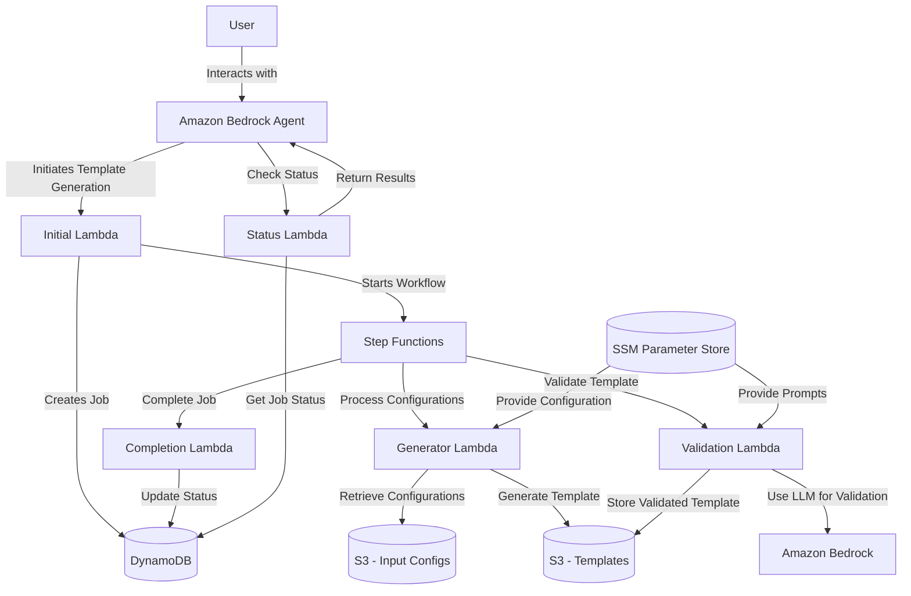

# Asynchronous CloudFormation Generator

## Overview

The Asynchronous CloudFormation Generator is a serverless application that processes resource configurations stored in S3 buckets and generates CloudFormation templates. It provides a natural language interface through Amazon Bedrock agents, allowing users to request template generation using conversational language.

## Architecture

The solution uses a serverless architecture built on AWS services, primarily leveraging Lambda functions orchestrated by Step Functions to process resource configurations and generate CloudFormation templates.

### Architecture Diagram



### Architecture Components

#### Lambda Functions

1. **Initial Lambda**
   - Entry point for the workflow
   - Validates input parameters (S3 bucket and folder path)
   - Creates a job record in DynamoDB
   - Starts the Step Functions workflow

2. **Generator Lambda**
   - Processes resource configurations from S3
   - Generates CloudFormation templates
   - Uploads templates to S3

3. **Validation Lambda**
   - Validates generated CloudFormation templates
   - Uses Amazon Bedrock to automatically fix errors
   - Ensures templates follow best practices

4. **Completion Lambda**
   - Finalizes job processing
   - Updates job status in DynamoDB
   - Archives processed configurations and templates

5. **Status Lambda**
   - Provides job status information
   - Retrieves execution details from Step Functions
   - Lists output files from S3

#### Other AWS Services

- **Amazon Bedrock Agent**: Provides a natural language interface for users
- **Step Functions**: Orchestrates the workflow with robust error handling and retry logic
- **DynamoDB**: Stores job status and metadata
- **S3**: Stores input resource configurations and generated templates
- **Parameter Store**: Stores prompt templates and configuration parameters

## Deployment Instructions

### Prerequisites

1. **AWS Account**: You need an AWS account with appropriate permissions
2. **AWS CLI**: Install and configure the AWS CLI with appropriate credentials
3. **Python 3.9+**: Required for local development and packaging
4. **S3 Bucket**: For storing deployment artifacts

### Deployment Steps

1. **Clone the Repository**

```bash
git clone https://github.com/yourusername/cfn-generator-project.git
cd cfn-generator-project
```

2. **Deploy the CloudFormation Stack**

```bash
cd scripts
./deploy.sh --region us-east-1 --env dev --stack-name cfn-generator
```

This script will:
- Create deployment packages for all Lambda functions
- Upload the packages to the specified S3 bucket
- Deploy the CloudFormation stack with all required resources
- Configure the Step Functions workflow
- Set up appropriate permissions

3. **Deploy the Bedrock Agent (Optional)**

```bash
aws cloudformation deploy \
  --template-file cloudformation/bedrock-agent.yaml \
  --stack-name cfn-generator-bedrock-agent \
  --parameter-overrides Environment=dev FoundationModelId=anthropic.claude-3-sonnet-20240229-v1:0 \
  --capabilities CAPABILITY_IAM \
  --region us-east-1
```

This will deploy a Bedrock agent that provides a conversational interface to the system.

## Usage Instructions

### Preparing Resource Configurations

1. Create a folder structure in your S3 bucket that organizes your resource configurations
2. Upload your resource configuration files (JSON or YAML) to the folder
3. Ensure the configurations follow the expected format for each resource type

### Starting a Template Generation Job

#### Using the Bedrock Agent

1. Navigate to the Amazon Bedrock console
2. Select "Agents" from the left navigation
3. Find and select your deployed agent
4. Use the "Test" tab to interact with the agent
5. Ask the agent to generate a CloudFormation template for your resources
   - Example: "Generate a CloudFormation template for the resources in s3://my-bucket/resources/lambda"

#### Using Direct API Invocation

```bash
aws lambda invoke \
  --function-name CFNGenerator-Initial \
  --payload '{"bucket_name":"my-bucket","s3_folder":"resources/lambda"}' \
  response.json
```

### Checking Job Status

#### Using the Bedrock Agent

Ask the agent about the status of your job:
- Example: "What's the status of job 12345?"

#### Using Direct API Invocation

```bash
aws lambda invoke \
  --function-name CFNGenerator-Status \
  --payload '{"job_id":"12345"}' \
  response.json
```

### Accessing Generated Templates

Once the job is complete, you can access the generated templates in the S3 bucket under:
```
s3://your-bucket/cfn-generator/output/job-id/template.yaml
```

## Key Features

- **Natural Language Interface**: Interact with the system using conversational language
- **Asynchronous Processing**: Long-running template generation jobs run asynchronously
- **Automatic Validation**: Templates are automatically validated and fixed
- **Job Tracking**: Track the status of template generation jobs
- **Error Handling**: Robust error handling and retry mechanisms
- **Best Practices**: Generated templates follow AWS best practices

## Troubleshooting

### Common Issues

1. **Job Status Shows Error**
   - Check CloudWatch Logs for the specific Lambda function that failed
   - Verify S3 permissions and bucket existence
   - Ensure resource configurations follow the expected format

2. **Template Validation Failures**
   - Check the validation errors in the job status
   - Review your resource configurations for issues
   - Ensure the configurations follow AWS CloudFormation syntax

3. **Permission Errors**
   - Verify IAM roles have appropriate permissions
   - Check S3 bucket policies

### Logging

All Lambda functions log to CloudWatch Logs. Check the following log groups for troubleshooting:

- `/aws/lambda/CFNGenerator-Initial`
- `/aws/lambda/CFNGenerator-Generator`
- `/aws/lambda/CFNGenerator-Validation`
- `/aws/lambda/CFNGenerator-Completion`
- `/aws/lambda/CFNGenerator-Status`

## Security Considerations

- All data is encrypted at rest using S3 default encryption
- IAM roles follow the principle of least privilege
- No sensitive information is stored in environment variables
- All API calls are authenticated and authorized through IAM

## Limitations

- Maximum resource configuration size: 10MB per file
- Maximum number of resources per template: 500
- Supported resource types: See documentation for the full list
- Maximum concurrent jobs: 10

## Contributing

Contributions are welcome! Please see [CONTRIBUTING.md](./CONTRIBUTING.md) for details.

## License

This project is licensed under the MIT License - see the LICENSE file for details.
