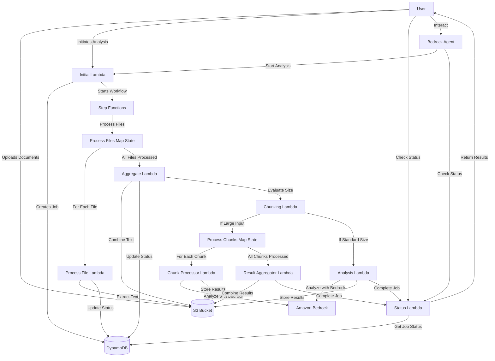

# Mainframe Modernization Project

## Overview

The Mainframe Modernization Project provides a serverless architecture for analyzing mainframe documentation to assist with modernization efforts. The system processes various document formats (PDF, DOCX, TXT), extracts text content, aggregates it, and uses Amazon Bedrock to analyze the content and provide modernization recommendations.

## Architecture

The solution uses a serverless architecture built on AWS services, primarily leveraging Lambda functions orchestrated by Step Functions to process and analyze mainframe documentation.

### Architecture Diagram



### Architecture Components

#### Lambda Functions

1. **Initial Lambda (`initial_lambda.py`)**
   - Entry point for the workflow
   - Validates input parameters (S3 bucket and folder path)
   - Lists files in the specified S3 location
   - Creates a job record in DynamoDB
   - Starts the Step Functions workflow

2. **Process File Lambda (`process_file_lambda.py`)**
   - Extracts text from individual files (PDF, DOCX, TXT)
   - Uploads extracted text to S3
   - Updates job progress in DynamoDB

3. **Aggregate Lambda (`aggregate_lambda.py`)**
   - Combines extracted text from all processed files
   - Prepares the full prompt for analysis
   - Updates job status in DynamoDB

4. **Chunking Lambda (`chunking_lambda.py`)**
   - Evaluates if the input size requires chunking
   - Splits large inputs into manageable chunks
   - Updates job status in DynamoDB

5. **Chunk Processor Lambda (`chunk_processor_lambda.py`)**
   - Processes individual chunks of text
   - Sends chunks to Amazon Bedrock for analysis
   - Stores chunk results in S3

6. **Result Aggregator Lambda (`result_aggregator_lambda.py`)**
   - Combines results from all processed chunks
   - Creates a consolidated analysis result
   - Updates job status in DynamoDB

7. **Analysis Lambda (`analysis_lambda.py`)**
   - Sends the aggregated content to Amazon Bedrock for analysis
   - Parses the response by AWS service type
   - Saves results to S3
   - Updates job status to completed

8. **Status Lambda (`lambda_function.py`)**
   - Provides job status information
   - Retrieves execution details from Step Functions
   - Lists output files from S3

#### Other AWS Services

- **Step Functions**: Orchestrates the workflow with robust error handling and retry logic
- **DynamoDB**: Stores job status and metadata
- **S3**: Stores input documents, extracted text, and analysis results
- **Amazon Bedrock**: Provides AI capabilities for document analysis
- **IAM**: Manages permissions and access control
- **CloudFormation**: Provisions and manages all resources

## Deployment Instructions

### Prerequisites

1. **AWS Account**: You need an AWS account with appropriate permissions
2. **AWS CLI**: Install and configure the AWS CLI with appropriate credentials
3. **Python 3.8+**: Required for local development and packaging
4. **S3 Bucket**: For storing deployment artifacts

### Deployment Steps

1. **Clone the Repository**

```bash
git clone https://github.com/yourusername/mainframe-modernization-project.git
cd mainframe-modernization-project
```

2. **Package Lambda Functions**

```bash
./scripts/3.package-lambdas.sh --region us-east-1 --env dev
```

This script will:
- Create deployment packages for all Lambda functions
- Upload the packages to the specified S3 bucket

3. **Deploy the CloudFormation Stack**

```bash
./scripts/1.deploy.sh --region us-east-1 --env dev --stack-name mainframe-transform
```

This script will:
- Create all required AWS resources (Lambda functions, Step Functions, DynamoDB, IAM roles)
- Configure the Step Functions workflow
- Set up appropriate permissions

4. **Deploy the Bedrock Agent (Optional)**

```bash
aws cloudformation deploy \
  --template-file cloudformation/bedrock-agent.yaml \
  --stack-name mainframe-transform-bedrock-agent \
  --parameter-overrides Environment=dev FoundationModelId=anthropic.claude-3-5-haiku-20241022-v1:0 \
  --capabilities CAPABILITY_IAM \
  --region us-east-1
```

This will deploy a Bedrock agent that provides a conversational interface to the system.

### Updating Lambda Code

If you need to update Lambda function code without redeploying the entire stack:

```bash
./scripts/2.update-lambda-code.sh --region us-east-1 --env dev --function initial
```

Replace `initial` with the specific Lambda function you want to update, or omit the `--function` parameter to update all functions.

## Usage Instructions

### Starting an Analysis Job

1. **Upload Documents to S3**

Upload your mainframe documentation (PDF, DOCX, TXT files) to an S3 bucket.

2. **Initiate Analysis**

```bash
./scripts/4.test-workflow.sh --region us-east-1 --bucket your-bucket --folder your-folder
```

This will:
- Start the analysis workflow
- Return a job ID for tracking

3. **Check Job Status**

```bash
aws lambda invoke \
  --function-name MainframeAnalyzer-Status \
  --payload '{"job_id":"your-job-id"}' \
  response.json
```

4. **Access Results**

Once the job is complete, you can access the results in the S3 bucket under:
```
s3://your-bucket/mainframe-analysis/your-job-id/
```

### Using the Bedrock Agent (If Deployed)

1. Navigate to the Amazon Bedrock console
2. Select "Agents" from the left navigation
3. Find and select your deployed agent
4. Use the "Test" tab to interact with the agent
5. Ask the agent to analyze your mainframe documentation or check the status of existing jobs

## Key Features

- **Parallel Processing**: Files are processed in parallel for efficiency
- **Error Handling**: Robust error handling at each stage
- **Progress Tracking**: Job progress is tracked in DynamoDB
- **Adaptive Timeouts**: Timeout calculations based on input size
- **Service-Specific Output**: Analysis results are organized by AWS service type
- **Chunking Support**: Large inputs are automatically split into manageable chunks
- **Retry Logic**: Comprehensive retry mechanisms for transient failures

## Troubleshooting

### Common Issues

1. **Job Status Shows Error**
   - Check CloudWatch Logs for the specific Lambda function that failed
   - Verify S3 permissions and bucket existence
   - Ensure input files are in supported formats (PDF, DOCX, TXT)

2. **Timeout Errors**
   - Large files may cause timeouts; consider increasing Lambda timeout settings
   - Very large documents may need to be split into smaller files

3. **Permission Errors**
   - Verify IAM roles have appropriate permissions
   - Check S3 bucket policies

### Logging

All Lambda functions log to CloudWatch Logs. Check the following log groups for troubleshooting:

- `/aws/lambda/MainframeAnalyzer-Initial`
- `/aws/lambda/MainframeAnalyzer-ProcessFile`
- `/aws/lambda/MainframeAnalyzer-Aggregate`
- `/aws/lambda/MainframeAnalyzer-Analysis`
- `/aws/lambda/MainframeAnalyzer-Status`
- `/aws/lambda/MainframeAnalyzer-Chunking`
- `/aws/lambda/MainframeAnalyzer-ChunkProcessor`
- `/aws/lambda/MainframeAnalyzer-ResultAggregator`

## Security Considerations

- All data is encrypted at rest using S3 default encryption
- IAM roles follow the principle of least privilege
- No sensitive information is stored in environment variables
- All API calls are authenticated and authorized through IAM

## Limitations

- Maximum file size: 100MB per file
- Maximum combined text size: 100,000 characters (configurable)
- Supported file formats: PDF, DOCX, TXT
- Maximum concurrent file processing: 10 files

## Contributing

Contributions are welcome! Please see [CONTRIBUTING.md](./CONTRIBUTING.md) for details.

## License

This project is licensed under the MIT License - see the [LICENSE](LICENSE) file for details.
